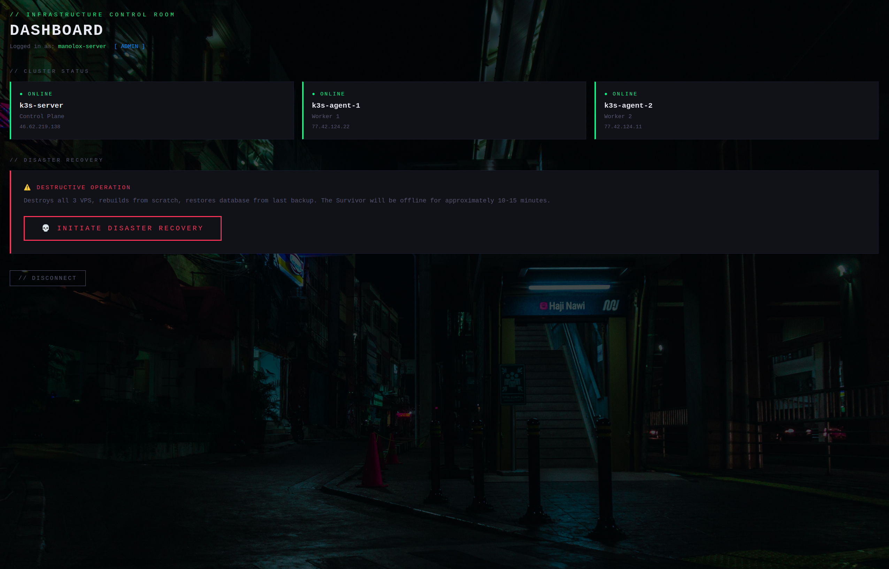
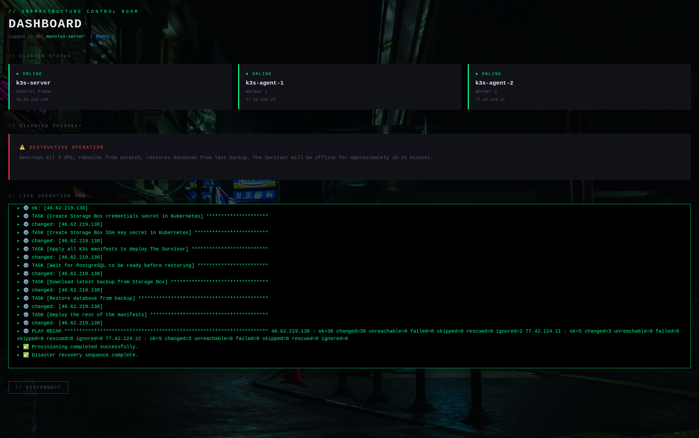

# infrastructure-demo-control — The Control Room

A Django application for orchestrating the full lifecycle of a 3-node K3s cluster on
Hetzner Cloud: provisioning, real-time status monitoring, and one-button disaster recovery
with live log streaming over WebSockets.

Built as the companion project to [job-tracker](https://github.com/juan-arroyo/job-tracker)
— the app that gets destroyed and comes back.

🎛️ **Live:** [https://control.jmarroyo.es](https://control.jmarroyo.es) *(login required)*  
🔗 **The app it controls:** [job-tracker](https://github.com/juan-arroyo/job-tracker)



*Cluster status panel — 3 nodes online, disaster recovery on standby*



*Disaster recovery in progress — Ansible output streamed live to the browser*

---

## What it does

- Displays real-time status of the 3 cluster nodes (Control Plane + 2 Workers) — polled every 10 seconds via HTMX
- Triggers full disaster recovery with a single button: destroy cluster → recreate servers → run Ansible provisioning
- Streams live Ansible output to the browser as it runs, via WebSockets
- Two access roles: **admin** (can trigger recovery) and **recruiter** (read-only observer)

---

## Stack

| Layer | Technology |
|---|---|
| Backend | Django 5 + Django Channels + Daphne (ASGI) |
| Database | PostgreSQL 16 |
| Realtime | WebSockets via Django Channels + Redis channel layer |
| Frontend | HTMX + Tailwind CSS + DaisyUI |
| Reverse proxy | Nginx |
| Infrastructure API | Hetzner Cloud Python SDK (`hcloud`) |
| Provisioning | Ansible + ansible-runner |
| Container runtime | Docker + Docker Compose |

---

## Architecture

```
Browser
  │
  ├── HTTP (HTMX polling every 10s) ──► Nginx ──► Daphne ──► Django views
  │                                                               │
  │                                                        Hetzner API
  │                                                     (cluster status)
  │
  └── WebSocket ──► Nginx ──► Daphne ──► Django Channels consumer
                                               │
                                         Redis channel layer
                                               │
                                     background thread
                                               │
                              ┌────────────────┼─────────────────┐
                              ▼                ▼                  ▼
                       Hetzner API       Hetzner API        ansible-runner
                     (delete servers) (create servers)    (provision.yml)
```

**Disaster recovery sequence (triggered by the button):**

1. Delete the 3 Hetzner VPS via API
2. Recreate them with reserved Primary IPs (DNS stays valid)
3. Poll SSH on each server until ready
4. Run `provision.yml` via ansible-runner — installs K3s, deploys the app, restores backup
5. Stream every step to the browser in real time

---

## Key design decisions

**Daphne instead of Gunicorn** — the app uses Django Channels for WebSockets, which requires an ASGI server. Gunicorn only handles WSGI.

**Reserved Primary IPs** — Hetzner Primary IPs survive cluster destruction. This means DNS records and the kubeconfig remain valid after a full rebuild — no manual updates needed.

**ansible-runner instead of subprocess** — captures Ansible output event by event, enabling real-time log streaming to the browser as the playbook runs.

**Background thread for recovery** — infrastructure operations take several minutes. Running them in a daemon thread lets Django respond immediately; the browser receives progress via WebSocket.

**Vault password via tempfile** — ansible-runner does not invoke bash, so `<(echo ...)` process substitution does not work. The vault password is written to a temporary file, passed to ansible-playbook, and deleted immediately after — even if the run crashes.

---

## Local Development

**Requirements:** Docker, Docker Compose

```bash
# Clone the repo
git clone https://github.com/juan-arroyo/infrastructure-demo-control.git
cd infrastructure-demo-control

# Copy and fill in the environment variables
cp .env.example .env

# Start all services
docker compose up --build
```

Open `http://localhost:8084` and log in.

```bash
# Create a superuser (admin role)
docker compose exec web python manage.py createsuperuser

# Create a read-only recruiter account
docker compose exec web python manage.py createsuperuser
# then set is_staff=False in the Django admin
```

> **Note:** The Hetzner API token and Ansible vault password are required for the disaster
> recovery button to work. Without them, the dashboard and cluster status panel are fully functional.

---

## Environment Variables

See `.env.example` for the full list. Key variables:

| Variable | Description |
|---|---|
| `HETZNER_API_TOKEN` | Hetzner Cloud API token — Read & Write |
| `HETZNER_SSH_KEY_NAME` | Name of the SSH key registered in Hetzner |
| `ANSIBLE_VAULT_PASSWORD` | Password to decrypt `provision_secrets.yml` |
| `ANSIBLE_DIR` | Path to the ansible directory on the host |
| `REDIS_URL` | Redis connection URL for Django Channels |

---

## Project Structure

```
infrastructure-demo-control/
├── backend/
│   ├── config/
│   │   └── settings/
│   │       ├── base.py       # shared settings
│   │       ├── dev.py        # local development
│   │       └── pi.py         # production (Pi + Cloudflare)
│   ├── control/              # dashboard and cluster status views
│   ├── deploy/               # Hetzner API, ansible-runner, WebSocket consumer
│   │   ├── hetzner.py        # all infrastructure operations
│   │   ├── views.py          # HTTP endpoints + background thread
│   │   └── consumers.py      # WebSocket consumer for log streaming
│   └── templates/
│       ├── control/          # dashboard and cluster status fragment
│       └── registration/     # login page
├── nginx/
│   └── nginx.conf            # reverse proxy + WebSocket upgrade headers
├── .env.example
└── docker-compose.yml
```

---

## Part of a Larger Demo

This repo is **The Control Room** — the panel that orchestrates the entire infrastructure lifecycle.

The companion project [job-tracker](https://github.com/juan-arroyo/job-tracker)
is the app that runs on the cluster, gets destroyed, and comes back from backup — in under 15 minutes.

Together they demonstrate: Django · WebSockets · Ansible · Hetzner API · Docker · Disaster Recovery
